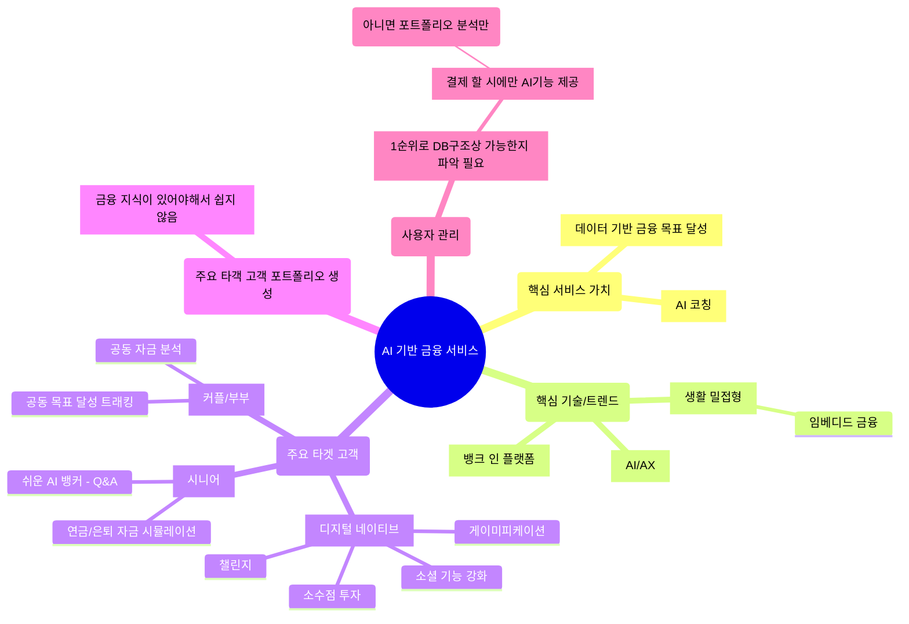

# SSAFY Project

## 아이디어 보드

## 목차
* [프로젝트 개요]
	* [프로젝트 정의]
	* [프로젝트 배경 정보]
	* [주요 성과 및 도전]
	* [주요 링]
* [기술 스택]
* [프로젝트 구조]

---

## I. Overview | 프로젝트 개요

### 1) Project Definition | 프로젝트 정의
#### Project Title | 프로젝트 명칭
#### Goal & Objectives | 목표 및 상세 목표
#### Problem | 문제 정의
#### Deliverables | 핵심 결과물
#### Key Features Summary | 주요 기능 요약

### 2) Project Context | 프로젝트 배경 정보
#### Project Duration | 프로젝트 기간
2025.11.07 ~ 2025.12.26
(총 8주 진행)
#### Team Composition | 팀 구성
|팀원|역할|담당 업무|
|홍여경|-|-|
|이건도|-|-|
#### Target User/Audience | 주요 사용자/대상 고객 정의
#### Context/Motivation | 프로젝트 배경 및 동기

### 3) Project Performance | 주요 성과 및 도전
#### Major Achievements | 주요 성과
#### Technical Challenges & Solutions | 기술적 난제 및 해결 방안

### 4) Quick Access | 주요 링크

---

## II. Tech Stack | 기술 스택

### 1) Front-end | 프론트엔드
### 2) Back-end | 백엔드
### 3) Database | 데이터베이스
### 4) AI Engine/Core Tech | AI 엔진/코어 기술
### 5) Infra/Deployment | 인프라/배포 환경
### 6) Tools | 협업 및 개발 도구
### 7) Version Control | 버전 관리

---

## III. Architecture | 프로젝트 구조

---

